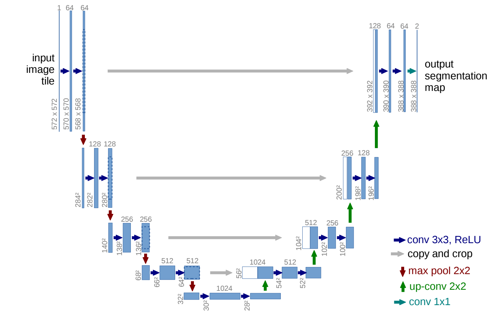

# From scratch implementation of the U-NET architecture

This repository is divided into two main folders:

- Simple from scratch implementation of the U-NET architecture. [link](./Raw_Unet)
  
- Improved implementation of the U-NET architecture with Training, Testing and Evaluation. [link](./Improved_Unet_Training&Eval)

-------

## Why ?

With how much Diffusion and the big models like SDXL are taking over and abstracting a lot of stuff, I end up only playing with ComfyUI with nodes. It's easy to forget the basics, I am doing this to not forget everything!

Since its introduction in 2015, the U-Net architecture started with image segmentation but has also found critical application in cutting-edge AI models like [Stable Diffusion](https://arxiv.org/abs/2307.01952) and [ControlNet](https://arxiv.org/abs/2302.05543).

## More About U-NET

The U-Net is a convolutional neural network that was developed for biomedical image segmentation ( [Arxiv Link](https://arxiv.org/abs/1505.04597) ). The network is based on the fully convolutional network and its architecture was modified and extended to work with fewer training images and to yield more precise segmentations. Segmentation of a 512x512 image takes less than a second on a modern GPU. The Architecture looks like this :
